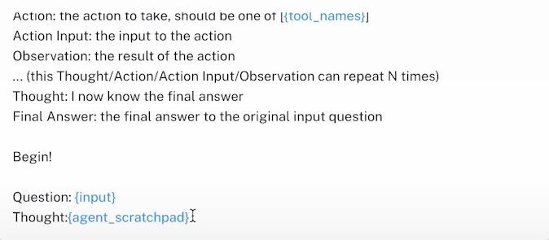
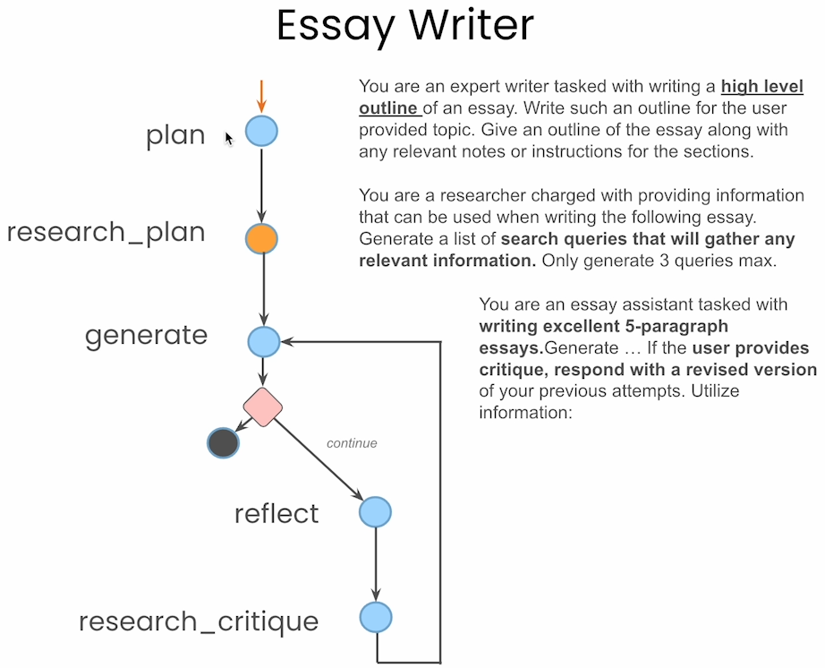

course https://learn.deeplearning.ai/courses/ai-agents-in-langgraph (via farago@gmx.de)

### 1 Introduction
https://learn.deeplearning.ai/courses/ai-agents-in-langgraph/lesson/1/introduction
* function calling LLMs have made tool use much more stable/predictable
* specific tools like search have been adapted for agentic use
	* answers (backed by links), not links that need to be followed
	* fixed format in answers
* Ng is a fan of LangChain, LangSmith and Tavily
* Agentic
	* iterative
	* multiple hats within the workflow
* just as a person, who also does not write that well if he needs to write a paper in one go, without using backspace
* Key design patterns of agentic workflows
	1. planning: thinking through the steps, e.g. write outline, a draft, revise it, do search
	2. tool use: which tools are available, and how to use them.
	3. reflection: iteratively improving results, with (possibly multiple) LLMs critiquing, making suggestions, 
	4. multi-agent communication: each agent is a uniquely prompted LLM, playing a unique role.
	5. memory: tracking progress and results.
* Many of these capabilities are implemented outside the LLM, by the framework they operate in, e.g. LangChain
	* Memory in multiple forms
	* Function calling 
	* Tool execution
	* LangGraph: supports cyclic graphs, which are necessary for many successful patterns

Further important capabilities:
* agentic search
* human input: to guide an agent at critical points
* persistence: store the current stage of information (for debugging and for productionalizing)

### 2 Build an Agent from Scratch

https://learn.deeplearning.ai/courses/ai-agents-in-langgraph/lesson/2/build-an-agent-from-scratch
* useful to notice what jobs fall to the LLM and what jobs fall to the code around the LLM, the **runtime**
* code example [[Lesson_1_Student.py|Lesson_1_Student.py]], based on https://til.simonwillison.net/llms/python-react-pattern

### 3 LangGraph Components

Last lesson:


Break this down into LangChain components:
#### 3.1 LangChain Prompts



where `agent_scratchpad` contains all the actions and observations.
More prompts, contributed by users, in the prompt hub.
#### 3.2 LangChain Tools


LangChain community package contains hundreds of other tools.
#### 3.3 LangGraph


**LangGraph** 
* lets you describe and orchestrate control flow, such as loops (cyclic graphs). See [[LangGraph_exemplaryWorkflows.png]] above: those workflows are all cyclic graphs.
* is an extension of LangChain that supports graphs
* single and multi-agent flows are described and represented as graphs
* allows for extremely controlled "flows"

LangGraph core concepts:
* **nodes**: agents or functions
* **edges**: connect nodes
* **conditional edges**: decisions


Comes with built-in **persistence**: 
* for having multiple conversations at the same time
* remembering previous iterations, actions, ...
* enables cool human-in-the-loop features

**Agent state**:

Annotation with `operator.add`: when the state is updated with new messages, the new messages do not override the old ones, but are added (otherwise, when a new state is pushed to that variable, the old value is overridden.)
? Why can agent_outcome be `None`?

Our ReAct example (from `Lesson_1_Student.py`):

Node "llm" calls OpenAI LLM, node "action" executes the action the LLM chose, if it chose one.

Code example: [[Lesson_2_Student.py|Lesson_2_Student.py]]

Output of `Image(abot.graph.get_graph().draw_png())`:


### 4 Agentic Search Tools

#### 4.1 Why a search tool?


Parametric knowledge can be outdated, and cannot give a reference. 

Using agentic search tool reduces hallucination and HCI friction

#### 4.2 How is agentic search different?

Example of a basic search tool implementation:

1. understand the question and divide it to sub-queries. This is important for handling complex queries.
2. for each sub-query, find the best source, choosing from multiple integrations.
	* e.g. for the query "How is the weather in SF", the weather API should be used
3. extract the information relevant to the sub-query. Basic implementation:
	1. chunk the source
	2. do a vector search
	3. retrieve the top-k chunks
4. search tool scores and filters the results
5. return topk docs
? Are multiple sources used and scoring & filtering is performed for each of the sources? Is top-k docs top-k sources?

#### 4.3 How to use it?

Code example: [[Lesson_3_Student.py|Lesson_3_Student.py]]

Tavily yields:
```json file:tavily_result.json
{
    "location": {
        "name": "San Francisco",
        "region": "California",
        "country": "United States of America",
        "lat": 37.775,
        "lon": -122.4183,
        "tz_id": "America/Los_Angeles",
        "localtime_epoch": 1736026501,
        "localtime": "2025-01-04 13:35"
    },
    "current": {
        "last_updated_epoch": 1736026200,
        "last_updated": "2025-01-04 13:30",
        "temp_c": 12.8,
        "temp_f": 55.0,
        "is_day": 1,
        "condition": {
            "text": "Partly cloudy",
            "icon": "//cdn.weatherapi.com/weather/64x64/day/116.png",
            "code": 1003
        },
        "wind_mph": 4.5,
        "wind_kph": 7.2,
        "wind_degree": 358,
        "wind_dir": "N",
        "pressure_mb": 1026.0,
        "pressure_in": 30.29,
        "precip_mm": 0.0,
        "precip_in": 0.0,
        "humidity": 77,
        "cloud": 75,
        "feelslike_c": 12.4,
        "feelslike_f": 54.4,
        "windchill_c": 10.2,
        "windchill_f": 50.4,
        "heatindex_c": 11.0,
        "heatindex_f": 51.8,
        "dewpoint_c": 7.6,
        "dewpoint_f": 45.7,
        "vis_km": 16.0,
        "vis_miles": 9.0,
        "uv": 1.8,
        "gust_mph": 5.9,
        "gust_kph": 9.5
    }
}
```
this is exactly what an agent wants to see.

In contrast, this is what a human wants to see:


### 5 Persistence and Streaming

Agents often work on longer running tasks. Two important concepts for this:
* **Persistence**: To keep around the state of an agent at a particular point in time
	* To resume that state in future interactions
* **Streaming**: Emit a list of signals of what's going on at that exact moment, for interpretability. 
* 
These are really powerful for building production applications:
* so that your agents are able to have multiple conversations with multiple users at the same time
* have a concept of memory so that your agents can resume those conversations.

Code example: [[Lesson_4_Student.py|Lesson_4_Student.py]]
* based upon [[Lesson_2_Student.py|Lesson_2_Student.py]]
* adds a **checkpointer**
	* checkpoints the LangGraph state (we only have `messages: Annotated[list[AnyMessage], operator.add]`) after and between every node
	* we will use `SqliteSaver`
		* a really simple checkpointer using SQLite, which is built in under the hood
		* use it with in memory
	* other checkpointers in LangGraph:  Redis, Postgres
	* pass in checkpointer to `graph.complie()`
* adds streaming
	* of individual messages (i.e. events)
		* `AIMessage`s
		* observation messages showing the result of taking that action (contained in corresponding `ToolMessage`s)
	* using the concept of a thread config
		* to keep track of different threads inside the persistent checkpointer, so we can have multiple conversations at the same time. This is needed in production with many users.
		* use dict `{"configurable": {"thread_id": "uniqueString"}}`
		* call graph not with `invoke` but `stream`
		* `stream` returns a stream of events, representing updates of the LangGraph state (we only have `messages: Annotated[list[AnyMessage], operator.add]`) over time
		* `HumanMessage` is already in the LangGraph state when calling `stream`, so those messages will not show up in the stream of events
	* of tokens themselves (i.e. for all LLM calls)
		* all output tokens
		* use `astream_events` method, available on all LangChain and LangGraph objects
		* is an asynchronous method, so we need an async checkpointer, so use `AsyncSqliteSaver` instead of `SqliteSaver`
		* `astream_events` also returns a stream of other kind of events, which represent updates from the underlying stream
		* find `on_chat_model_stream` events to get events that correspond to new tokens
	* streaming

Persistence is also important for human in the loop interactions.

### 5 Human in the loop

You often want to keep the human in the loop, which is easy to do in LangGraph.

New LangGraph version has a couple of key additions:
- Additional state information is stored to memory and displayed when using `get_state()` or `get_state_history()`.
- State is additionally stored every state transition while previously it was stored at an interrupt or at the end. These change the command output slightly, but are a useful addition to the information available.

Code example: [[Lesson_5_Student.py|Lesson_5_Student.py]]
* based upon [[Lesson_4_Student.py|Lesson_4_Student.py]]
* for human in the loop interactions, we want to replace existing messages
	* do this with a custom reduce messages function `reduce_messages` that looks for messages with the same ID, and if it sees that you are inserting one with the same ID as one that already exists, it replaces that. Otherwise, appending as before.
	* If a message (this is the case for `HumanMessage`s) does not yet contain an id, add one
* add interrupt before we call node "action", for manual approval before we run any tool, to make sure tools are executed correctly. Alternatively, you could only interrupt when a certain tool is called: TODO
* to continue after interrupt, we can simply call `abot.graph.stream(None, thread)`; since "messages" is annotated in a way such that `None` does not change the messages attribute from `AgentState`, so we are simply continuing

#### 5.1 State memory

As the graph is being executed, a snapshot of each state is executed in memory:


What's in the `StateSnapshot`:

* the `AgentState`, as defined in our code
* the `thread` config (see code), consisting of 
	* `thread_id` to identify the thread
	* `thread_ts` to identify the snapshots. Use it to access the snapshots:

Commands to access the memory:
* `graph.get_state({"configurable": {"thread_id": "42"}})` (see code): returns the current state
* `graph.get_state_history({"configurable": {"thread_id": "42"}})`: returns iterator over all `StateSnapshot`s
* `graph.invoke(None, {"configurable": {"thread_id": "42", "thread_ts": ...}})` or `graph.stream(None, {"configurable": {"thread_id": "42", "thread_ts": ...}})` runs with that snapshot as starting point. This is time travel:

as opposed to 

* `graph.get_state({"configurable": {"thread_id": "42", "thread_ts": ...}})`: returns `thread_ts` state snapshot `state1`

#### 5.2 Modify state
* you can modify that state snapshot `state1` to `state1m` and then call `graph.update_state({"thread_id": "42"}, state1m)` to store it back on top, as new current state. When you then run `stream` or `invoke`, `state1m` will be used as its starting point:

Code example [[Lesson_5_Student.py|Lesson_5_Student.py]] at `# Modify State:` shows how to modify the state of the graph in order to control what the agent does (report weather in Louisiana instead of LA).
#### 5.3 Time Travel

See State Memory images above: 
* We are keeping a running list of all these state. When we modified a state, we created a new state. When we update the graph, the new state is ADDED. 
* This allows us to go back and visit previous states. This is called **time travel**.

Code example [[Lesson_5_Student.py|Lesson_5_Student.py]] at `# Time Travel:` shows how to time travel by
1. store the states in an list
2. pick the state `to_replay` before action, i.e. before tool calling
3. call `graph.stream(None, to_replay.config)`

#### 5.4 Go back in time and edit

Mix of time travel and modify state, see code example [[Lesson_5_Student.py|Lesson_5_Student.py]] at `# Go back in time and edit:` shows how to travel back to a previous, but edited state:
1. pick `to_replay` again
2. modify it as in [[Deeplearning course ai-agents-in-langgraph#5.2 Modify state]]
3. branch of into `branch_state` with `branch_state = abot.graph.update_state(to_replay.config, to_replay.values)`
4. execute from `branch_state` via `graph.stream(None, branch_state)`

#### 5.5 Add message to a state at a given time

Instead of calling Tavily, we want to mock a response by appending a new message into the state, see code example [[Lesson_5_Student.py|Lesson_5_Student.py]] at `# Add message to a state at a given time:` shows how to:
1. get the `tool_call_id` that is expected from the next tool call, from `to_replay`
2. create a new message `sate_update`
3. update the state in the graph via `graph.update_state(to_replay.config, state_update, as_node="action")`. 
	* Since `state_update` is a new message, it is not going to replace an existing message, it is going to append it to the list of messages.
	* by adding the `as_node="action"` parameter, we are doing the modification as if we were the action node
4. calling `graph.stream(None, branch_and_add)` executes without taking an action anymore, but causes an `AIMessage` event.

#### 5.6 Summary

Overall, we have seen a lot of advanced and complicated human-in-the-loop interaction patterns that give you more control:
* add a break, so humans can approve/deny
* modify current state
* how go back in time
* modify past state
* update state manually to give the result of a tool manually, rather than really calling the tool. 

#### 5.7 Extra practice

##### 5.7.1 Build a small graph

A tiny graph is very helpful for understanding and debugging.

##### 5.7.2 Go back in time

Call `graph.invoke(None, states[-3])` to go back in time with `states[-3]` as current_state. 

Afterwards, the memory contains branches, as you can see via `config`'s and `parent_config`'s `thread_ts`s.

##### 5.7.3 Modify state

`graph.update_state(thread2,save_state.values)` creates a new entry at the top (latest entry) in memory. The new entry on top has
* the previous top as parent
* `count` 1 because update -3 was added to the previous count value 4, rather than replacing it.

##### 5.7.4 Modify state using as_node

The `as_node` argument to `graph.update_state` specifies the writer, so that graph traversal knows which starting point (aka "writer") to assume.

### 6 Essay Writer

Essay Writer is a compact version of an AI researcher:

* `plan`: generates a plan, once upfront.
* `research_plan` does some research based on that plan, which involves calling Tavily and getting back some documents.
* `generate` follows the plan using the documents from `research_plan` to write the essay.
* in case we continue, we go to `reflect`, where we generate a critique of the current essay
* `research_critique` is another research step calling Tavily, to get another set of documents we append to the existing documents.

`AgentState` has:
* `task`, the human input
* `plan`, generated by the `plan` node.
* `draft` of the essay
* `critique`, generated by the last iteration of `reflect` node
* `content` is the list of documents that Tavily retrieved
* `revision_number` keeps track of the number of revisions we have made
* `max_revisions` is used for the exit criterion.

See code example [[Lesson_6_Student.py|Lesson_6_Student.py]]:


Example memory contents early on (from the MemoryWriter GUI):

Memory contents after UpdateState:


* [ ]  Loop back to `planner`, because on the start, without any documents, `planner` might have needed lots of guesses.

### 7 Langchain Resources

python.langchain.com/docs/get_started/introduction:

* Tavily is part of LangChain-Community
* LangChain OpenAI is a separate partner package
* LangChain itself is more high-level, good entry points
* Templates can easily be deployed with LangServe
* LangServe easily turns your LangChain application into a web server

github.com/langchain-ai/langchain
* cookbooks 
* templates

github.com/langchain-ai/langgraph
	* in-depth documentation (reference docs, tutorials, how-tos)

deeplearning.ai/short-courses:
* Functions, Tools, and Agents with LangChain
* ...

smith.langchain.com/hub
* get inspiration
* see what other expert prompters are doing

### 8 Conclusion

Agent flows we did not cover, but you should know about:

#### 8.1 Multi-Agent

* **Multi-Agent Architecture**: when multiple agents work on the same shared state, i.e. passing the state around from one agent to the next
* each agent can have their own tools
* each agent can have an own loop inside them.

#### 8.2 Supervisor


* Supervisor Agent is calling sub-agents
* Supervisor determines input to the sub-agents
* Sub-Agents can have different states inside them, they are a LangGraph each
* vaguely similar to multi-agent architecture, but emphasizes that there is one supervisor in charge of routing, coordinating other agents
* good when you have a powerful LLM for the supervisor (planning requires a lot of intelligence)

#### 8.3 Flow Engineering

* comes from an AlphaCodium paper where they achieve SotA coding performance
* graphical like solution
	* basically a pipeline
	* few key nodes that actually loop
* thus directed flow up to a certain point, then you have iterations
* bespoke architecture for a particular coding problem, but the concept of flow engineering extends more broadly: think about the right information flow for your agents to take actions and think.

#### 8.4 Plan and Execute Paradigm


* plan & execute style flow is common paradigm/pattern
	1. plan upfront: steps that a sub-agent should do
	2. execute that plan: do one plan step (i.e. sub-task) with a sub-agent, which can do iterations to achieve sub-task. Maybe you update plan during this iteration
	3. update plan: update state with task results and replan.
	4. respond to user or go back to step 2.

#### 8.5 Language Agent Tree Search

* based on https://arxiv.org/abs/2310.04406: Language Agent Tree Search Unifies Reasoning, Acting, And Planning in Language Models
* tree search over the state of possible actions
	1. select node
	2. generate new candidates
	3. act, reflect, and score
	4. backprop (update parents)
* here you can see why persistence is really important: you need to be able to update earlier states and to time travel

#### 8.6 Conclusion

LangGraph is really flexible in covering all these architectures and patterns. This is different from other frameworks and crucial to creating agents that actually work.

Course Achievement:
https://learn.deeplearning.ai/accomplishments/16b331d0-b58e-4715-9dbe-e03ccf55fb54?usp=sharing